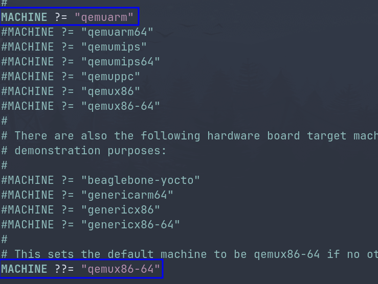
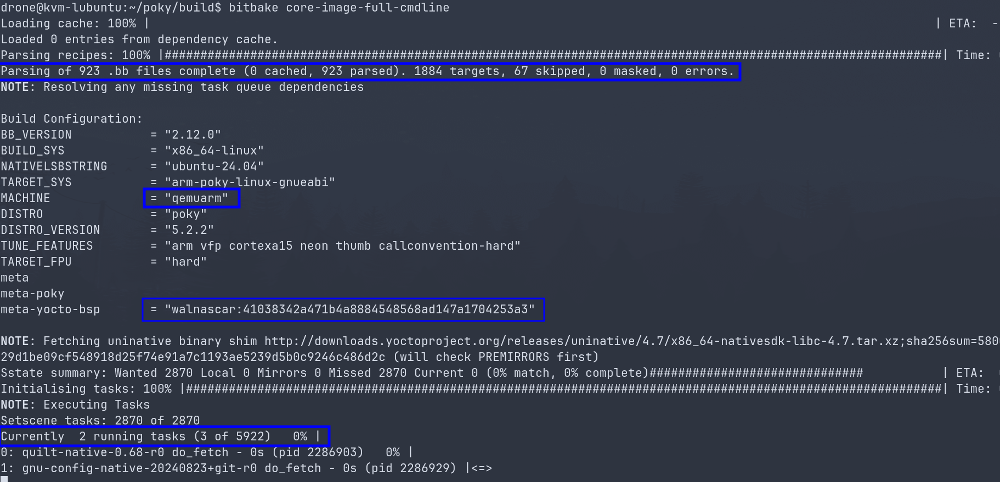
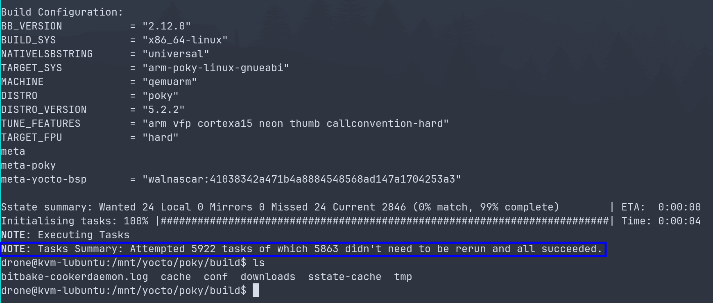
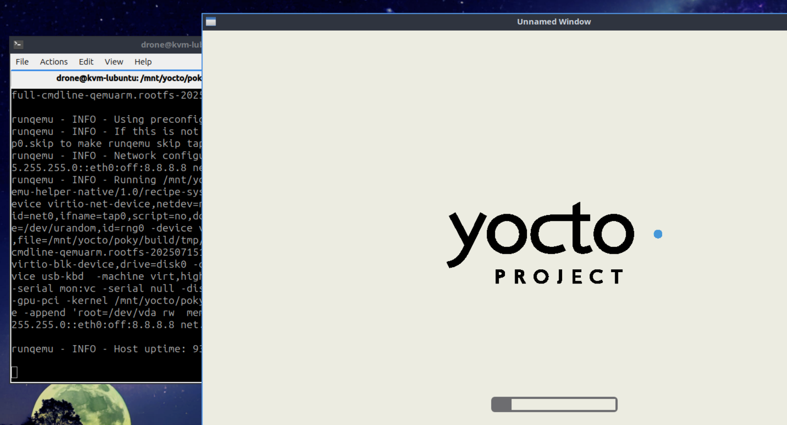
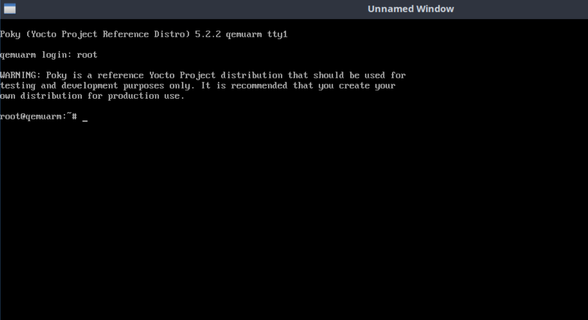
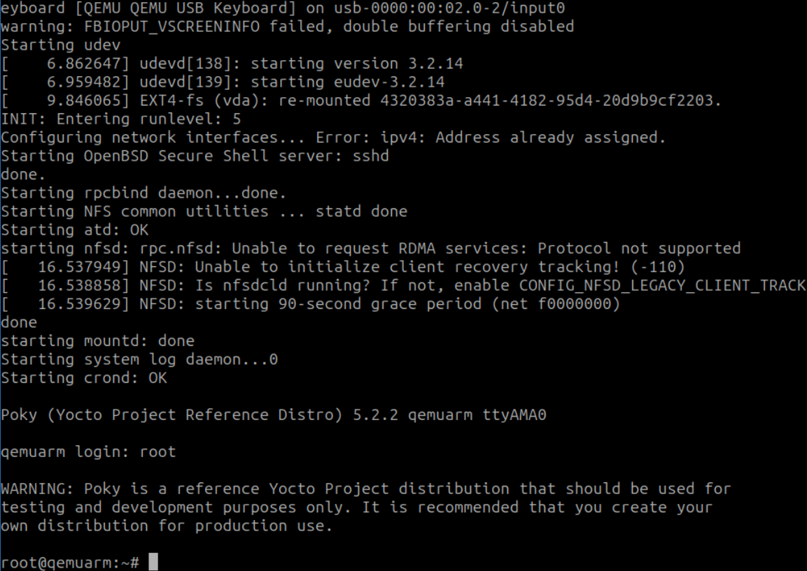

+++
title = 'Building a Poky (Yocto Project) Image for QEMU'
date = 2025-07-16T22:29:45+03:00
draft = false
tags = ["Linux", "Yocto", "bitbake", "poky", "qemu"]
+++

After looking at why you should build your own distribution in [Rolling you own Linux distro with Yocto](/posts/rolling_you_own_linux_distro_with_yocto),
And then looking on how [bitbake works](/posts/hands_on_introduction_to_bitbake), it is time to dip our toes in the water and create first
real image out of poky reference repository and actually run it using a virtual machine.

# Prerequisites
I will be using Ubuntu 24.04.2 LTS, and will have about 100G of free space.

1. Install required packages:
```bash
sudo apt install liblz4-tool gawk wget git-core diffstat unzip texinfo gcc-multilib build-essential chrpath socat libsdl1.2-dev xterm
```

2. Clone poky which is the Yocto reference distribution(walnascar branch):
```bash
 git clone git://git.yoctoproject.org/poky -b walnascar ~/poky
```

# Poky directory overview
After cloning the poky repository a directory with the following files will be produced:
```text
drwxrwxr-x  bitbake
drwxrwxr-x  contrib
drwxrwxr-x  documentation
-rw-rw-r--  LICENSE
-rw-rw-r--  LICENSE.GPL-2.0-only
-rw-rw-r--  LICENSE.MIT
-rw-rw-r--  MAINTAINERS.md
-rw-rw-r--  MEMORIAM
drwxrwxr-x  meta
drwxrwxr-x  meta-poky
drwxrwxr-x  meta-selftest
drwxrwxr-x  meta-skeleton
drwxrwxr-x  meta-yocto-bsp
-rwxrwxr-x  oe-init-build-env
lrwxrwxrwx  README.hardware.md -> meta-yocto-bsp/README.hardware.md
lrwxrwxrwx  README.md -> README.poky.md
-rw-rw-r--  README.OE-Core.md
lrwxrwxrwx  README.poky.md -> meta-poky/README.poky.md
-rw-rw-r--  README.qemu.md
drwxrwxr-x  scripts
-rw-rw-r--  SECURITY.md
```


- **bitbake**: Contains among other things bitbake command which is a python script. When the oe-init-build-env script is sourced,
the bitbake command is added to the system's $PATH variable, making it accessible for building Yocto Project images.
- documentation: all documentation sources for the Yocto project documentation, can be used to generate nice PDSs.
- **met**a: This is the 'oe-core' layer, which is the foundational metadata layer for the OpenEmbedded build system.
It contains the core recipes, classes, and configurations for building a wide range of Linux components.
- **meta-poky**: a layer that holds the configuration for the poky reference distribution local.conf.sample, and bblayers.conf.sample files are present here. These files are the basis of the build/conf directory that is created after executing the source command.
- **meta-skeleton**: contains template recipes for BSP and kernel development
- **meta-yocto-bsp**: Maintains several BSP layers such as the Beaglebone, EdgeRouther and generic versions for both the 32 and 64 bit IA machines
- **meta-selftest**: Contains recipes and configurations specifically for running self-tests on the Yocto Project build system itself, ensuring its integrity and functionality.
- **scripts**: Contains a collection of utility scripts, including tools for setting up the
environment (like oe-init-build-env, though it's also at the root), development tools, and scripts for
flashing generated images onto target devices, such as runqemu for running images in QEMU.
- **contrib**: Contains various contributed scripts and tools that can be useful for Yocto Project development but are not part of the core build system.
- **oe-init-build-env**: - This is the crucial script that you 'source' to set up your build environment. It configures
environment variables, adds BitBake to your PATH, and creates the 'build' directory with default configuration
files (local.conf and bblayers.conf) if they don't already exist.


## The build directory
The build directory is not part of the poky repository, it is a temporary directory generated by sourcing oe-init-build-env command.
This means that changes made to files inside the build directory are local to a specific instance of the build directory and not tracked
by source control by default.

To generate the build directory, form the root of ~/pokey execute:
```bash
. oe-init-build-env
```
After that you should be moved into ~/poky/build and in it:

```text
drone@kvm-lubuntu:~/poky/build$ tree
.
└── conf
    ├── bblayers.conf
    ├── conf-notes.txt
    ├── conf-summary.txt
    ├── local.conf
    └── templateconf.cfg
```

conf - This directory holds the primary configuration files for your Yocto Project build. These files control everything from the target machine and enabled layers to download locations and build output.

- **local.conf**: Configures almost every aspect of the build system contains local user settings. This file is a very convenient way to
override several default configurations over all the Yocto project's tools. Notable variables:
    - **MACHINE**: Specifies the target hardware architecture or board for which the image is being built (e.g., 'qemux86-64' for a 64-bit QEMU virtual machine, 'raspberrypi4' for a Raspberry Pi 4).
    - **DL_DI**R: Defines the directory where BitBake downloads all source code archives (tarballs, git repositories, etc.) required for the build from various upstream projects. By default, it's typically set to a 'downloads' directory within your build directory (e.g., 'build/downloads'). It's often recommended to move this to a shared, persistent location outside the build directory to avoid re-downloading files across different builds or cleanups.
    - **SSTATE_DIR**: Specifies the shared state cache directory. This is crucial for incremental builds, as it stores compiled objects, packages, and other build artifacts. If a task's inputs haven't changed, BitBake can retrieve its outputs directly from the sstate cache, significantly speeding up subsequent builds. By default, it's often 'build/sstate-cache'. Similar to DL_DIR, it's often moved to a persistent, shared location.
    - **TMPDIR**: Defines the temporary directory where all intermediate build output, such as compiled work, package staging areas, and logs, are placed during the build process. By default, this is the 'tmp' directory inside your build directory (e.g., 'build/tmp'). This directory can become very large.
- **bblayers.conf**: This file is critical for defining which metadata layers BitBake should consider and parse during the image
build process. Each line in the BBLAYERS variable specifies the absolute path to a layer that contains recipes, classes, and
configurations relevant to your build. BitBake uses the order of layers in this file to resolve potential recipe and
variable overrides.
- **templateconf.cfg**: This file is used by the oe-init-build-env script to determine where to find the sample local.conf and
bblayers.conf files when initializing a new build directory. It essentially points to the meta-poky/conf directory (or similar)
where these templates reside.

# Creating arm image for qemu
Assuming you already sourced oe-init-build-env you should be inside of the ~/poky/build

1. Setting the build architecture, is done by editing **local.conf** By default machine is set to qemux86-64, this option is intended for the QEMU
emulator, In order to change this default edit the local.conf file. There are architectures for the QEMU emulator and also a few generic
architectures for actual boards. For this quick start, I set the build for qemuarm architecture by uncomment the qemuarm line. Doing so
will override the default value.


2. You then need to disable app armor temporary
```bash
echo 0 | sudo tee /proc/sys/kernel/apparmor_restrict_unprivileged_userns
```

3. Building the image is done by executing:
```bash
bitbake core-image-full-cmdline
```

Once the process starts you will get see something resembling this:



Notice the parsing of .bb files, the architecture(qemuarm), the branch we picked when cloning, and the executing of multiple tasks
in parallel (fetching source, compiling, installing...).

<u>Note that bitbake is pulling a lot of repositories for this build, you might see warning about looking for another mirror.
If bitbake completely fails to fetch source, run the above command again.</u>

And Once the build is complete you will get a summary that should show all tasks succeeded.


## The build artifacts
Once the build is done you will notice a change in the ~/poky/build directory, as new
directories will be created in it.
```text
-rw-rw-r--  bitbake-cookerdaemon.log
drwxrwxr-x  cache/
drwxrwxr-x  conf/
drwxrwxr-x  downloads/
drwxrwxr-x  sstate-cache/
drwxrwxr-x  tmp/
```
- **download**s: Holds all the upstream/tarballs/git repositories of the recipes used in the build.
And is defined by the DL_DIR variable.
- **sstate-cache**: shared state cache used to speed up the build process.
- **tmp**: Holds all the build system output.
    - **~/poky/build/tmp/deploy/images/${MACHINE}**: - contains the images that were created.
    - **~/poky/build/tmp/deploy/rpm**: Holds the rpm package files. Such a files can be useful in case a
    single rpm file is required to be installed on an already existing device/QEMU machine..
- **cache** - used by the bitbake parser.

Looking into the ~/poky/build/tmp/deploy/qemuarm we can find the artifacts of the build(qemuarm being the
architecture we picked for this build).


# Using qemu to run the poky build
As previously mentioned the poky repository has a scripts directory, with one
of the scripts, runqemu, being a wrapper to use qemu to run artifacts generated by
bitbake.

To use the script you should make sure you sourced ordered oe-init-build-env(which
will add it the shell PATH variable), and then from the build directory execute:
```
runqemu qemuarm
```
A virtual machine window should open and systemd init system will start running following the yocto loading.


If all goes well you should see a login screen, use root as the user name (no password is required).


You can also run the VM in a non gui mode using:
```
runqemu qemuarm nographic
```

