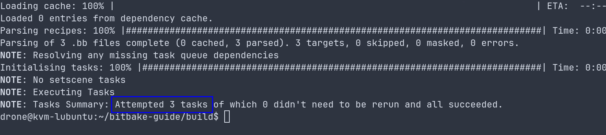
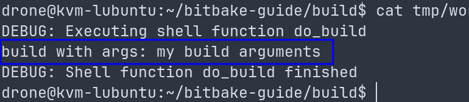

+++
title = 'Intro to Yocto, part 2 - Hands-On Introduction to BitBake'
date = 2025-07-09T18:47:34+03:00
draft = false
tags = ["Linux", "Yocto", "bitbake", "poky"]
+++

---
**All posts in this series:**
1. [Intro to Yocto, part 1 - Rolling your own Linux distro with yocto](/posts/rolling_you_own_linux_distro_with_yocto)
2. (current) [Intro to Yocto, part 2 - Hands-On Introduction to BitBake](/posts/hands_on_introduction_to_bitbake)
3. [Intro to Yocto, part 3 - Building a Poky (Yocto Project) Image for QEMU](/posts/building_a_poky_yocto_project_image_for_qemu)
4. [Intro to Yocto, part 4 - Yocto for raspberry pi4, build, boot, and cross compile](/posts/yocto_for_raspberry_pi4_clone_build_boot)

---

# Preface
This post is based on a [tutorial](https://a4z.gitlab.io/docs/BitBake/guide.html) by Harald Achitz. As I was following
it I was adding notes to it for context, and clarity. Filling in the blanks I came across and
refactoring the structure for readability.

If you haven't yet read [Rolling you own Linux distro with Yocto](/posts/rolling_you_own_linux_distro_with_yocto)
you should pause and start with it as it is a good intro into Yocto and goes over
what it is and why use it.

BitBake is, first and foremost, a build automation tool written in Python. It is driven by
user-created configuration and can execute user-defined tasks for specified targets,
known as recipes. Configuration, tasks, and recipes are written in a kind of BitBake
domain-specific language (DSL), which consists of variables and executable shell or Python code.

## Caveats

This post does not strive to repeat the solid [documentation](https://docs.yoctoproject.org/bitbake/2.12/index.html) that already exist for BitBake.

The goal of this post is to go over how BitBake works. This is not how BitBake
is used in the context of Yocto/poky to create images (that is a separate topic
for a different post). This post will cover the mechanics of BitBake using a
very bare bones project which has layers and recipes that do not do much, and won’t get you
an image to flash. Instead, by the end of this post you should have a solid grasp of the
fundamental parts of a Yocto image and how they are operated upon by the BitBake build
automation tool.

It's also worth to noting that if we had used a Yocto project we would have had a meta-core layer
which has bunch of base configurations in it(such as core name == version name of Yocto release).
Instead we will create our own “meta-core” layer and to avoid confusing it with the
actual “meta-core” layer will call it meta-tutorial.

## How to read this post

I have created a [repository](https://github.com/p3t33/bitbake-guide) so we can follow the steps I made
precisely, as each commit mirrors the work that was done as part of a
single headline (E.g Initial BitBake project layout).

Meaning if you clone the repository and checkout the commit that corresponds to your current headline
you should be able to "vibe" with the post. A more recommended and involved (From how long term memory
works perspective) approach would be to use my repository as a reference while you create your own as you go over
this post, As I did when I first wrote it.
- As a Headline represents multiple steps, keep in mind that each commit has the total work done in the Headline.
- If you come across a conflict between code snippets in the post and the repository the is the single
source of truth.


# Prerequisites
- I will be using Lubuntu 24.04.2 LTS.
- I am using bash shell.
- python3 and git should be installed.

1. Clone bitbake repository into ~/

```bash
git clone https://github.com/openembedded/bitbake.git ~/bitbake
```

And checkout to branch 1.52:
```bash
git checkout 1.52
```

2. Export paths at .bashrc by adding
```text
export PATH="$HOME/bitbake/bin:$PATH"
export PYTHONPATH="$HOME/bitbake/lib:$PYTHONPATH"
```

Save the file and run:
```bash
. ~/.bashrc
```

3. Test everything is working by executing
```bash
bitbake --version
```

You should get

```text
BitBake Build Tool Core version 1.52.0
```

# Initial BitBake project layout
The minimal configuration will look like this (executing tree from ~/bitbake-guide):
```text
~/bitbake-guide
├── build
│   ├── bitbake.lock
│   └── conf
│       └── bblayers.conf
└── meta-tutorial
    ├── classes
    │   └── base.bbclass
    └── conf
        ├── bitbake.conf
        └── layer.conf
```

## build/conf/bblayers.conf
- This file is a configuration file and it specifies the different layers that are part of our Yocto build.
- It needs to go into build/conf directory because it is the path where BitBake will look as specified by BUILDDIR variable. In my file I have
   ```text
   BBPATH := "${TOPDIR}"
   BBFILES ?= ""
   BBLAYERS = "${TOPDIR}/../meta-tutorial"
   ```
   - **BBPATH**: variable used by BitBake to determine where it should look for the various components of the build
     system. TOPDIR is an environment variable that points to the top level of the build directory(in this and most cases
     the ~/bitbake-guide/build directory) It is in a sense an equivalent to $PATH. <u>Note this variable is mutable and
     will get updated with each layer it needs to handle.</u>

   - **BBLAYERS**: variable is a list of all the directories that contain layers to include in the build.
   The layers are scanned <u>in the order they appear in this list</u>. In this case, it looks like we are including a layer
   named meta-tutorial, located at one directory level up from the TOPDIR which is the root of the build/working directory.
   - **BBFILES**: variable holds a space-separated list of file and directory paths where BitBake
   should look for .bb files. In this case, it's being set to an empty string, which means it's
   probably being defined elsewhere in the build system.


Note: bblayers.conf should only have BBLAYERS and other the other variables should not be defined at such high
abstraction level. The only reason they are here is because this is the content of the file as it came from the
BitBake repository.

-  := vs ?=
   - :=  is an immediate set operator, meaning the variable is set to the value immediately
   - ?= is a conditional set operator, which sets the value of the variable only if the variable
   is not set previously. If the variable has already been set, ?= will not overwrite the value.

## meta-tutorial/conf/layer.conf
This is the meta-tutorial layer yconfiguration file, and each layer needs one of those.
This file is crucial as it provides BitBake with necessary layer-specific information such as
where to find the layer's recipes and any layer-specific configurations or overrides.

-  **layer.conf** It needs to go into meta-tutorial/conf directory because it is the path where BitBake will look a for it by default. In this file, I have:
   ```text
     BBPATH .= ":${LAYERDIR}"
     BBFILES += "${LAYERDIR}/recipes-*/*/*.bb"
   ```
     - **LAYERDIR**: will be translated to BitBake-guide/meta-tutorial(or absolute path not sure).
     - **BBPATH**: will append bitbake-guide/meta-tutorial to the current value of BBPATH
     - **BBFILES** The ${LAYERDIR}/recipes-*/*/*.bb pattern tells BitBake to look for .bb files in any subdirectory of the recipes-* directories under the layer's root directory.
     - **recipes-***: is a directory prefix to the way that a specific recipe defined.

As I already mentioned BBPATH and BBFILES should have stayed out of bblayers.conf which is a high level abstraction file. While
layer.conf is the file that is a layer specific and should append to the BBPATH and BBFILES

- .=  vs +=
Both append data. but with different delimiters
.= is used with : delimiter.
+= is used with “ ”(space) delimiter.

## The flow(based on data so far)
1. **BBPATH**: variable is initially set with default paths where BitBake starts looking for necessary
files for the build process, such as class files and configuration files. These paths are typically
part of the basic Yocto Project and OpenEmbedded core setup. This variable does not
have the path to bblayers.conf which is not part of BBPATH and is expected to be in his on
preset path.
2. **BBLAYERS**: This variable is defined in the bblayers.conf file of your build directory. It tells
BitBake which layers to include in the build. Each entry in the BBLAYERS list is the path to a
layer's root directory.
3. For each layer specified in BBLAYERS, BitBake reads the layer's layer.conf file (which should be located in the conf directory within the layer's root directory).
4. Within each layer.conf file, BBPATH is often appended with the path to the current layer's directory (LAYERDIR). This allows BitBake to find any layer-specific files
that might be needed during the build process.
5. Also within the layer.conf file, BBFILES is typically appended with a pattern that specifies the locations of the recipes (.bb files) within the layer. This tells BitBake where
to find the recipes that the layer provides. Those recipes contain instructions for how to build a specific piece of software.
6. BitBake combines all of these settings from all of the included layers, which results in a comprehensive list of directories to search for files (BBPATH), and a
comprehensive list of recipes to consider for the build (BBFILES).

*BBFILES tells where in the layer to look for .bb files This way .bb files can be added without the need to update the conf/layer.conf . And BitBake will automatically include
them in the next build.

## base.bbclass and bitbake.conf
At this point I just copied the default files from the BitBake repository I cloned as part of the prerequisites.
I copied ~/bitbake/conf/bitbake.conf to ~/bitbake-guide/meta-tutorial/conf
I copied ~/bitbake/classes/base.bbclass to  ~/bitbake-guide/meta-tutorial/classes

This was done in the context of the tutorial as a rule there is no real need to put this files inside a layer level directory.
This files are used as the high global level, And then recipes in the lower layer inherit the base classes that will be
in the These files are generally provided by the core layers of the Yocto Project or OpenEmbedded, such
as the OpenEmbedded-Core layer (meta).

** The first run
Execute form the build directory(~/bitbake-guide/build)
```bash
bitbake
```

If all goes well you, should see the following message


To get more information you can execute:
```bash
bitbake -vDDD world
```
With -VDDD is verbose as possible, and wold is just a name of a target to build.

### The cache location
Since we have no recipe and target world, BitBake exits with an DEBUG message. This is OK for now and
we will fix this in the later.

This is because we are not using Yocto where this variable will be already set but only BitBake.
This can be solved by adding CACHE ?= "${TOPDIR}/cache" to bitbake.conf.

## Tasks and the dependency chain
Recipes have tasks in them, and classes are encapsulated tasks that can be reused by recipes. But "one
simple don't run tasks(functions) inside of a recipe". BitBake has a default chain of tasks it will execute
in a certain order(chain). Such as do_fetch, do_unpack, do_patch, do_configure, do_compile,
do_install, and do_build. In order for a task in a recipe to be executed it needs to be “hooked” into the
default chain of execution, task can be hooked directly into one of the default tasks or it can be the last
node of a long chain of other tasks, each depended on one another and ending depended on one of
the default BitBake tasks.

The one exception is when a recipe overrides a default BitBake function. In this case it does not need to
hook into anything because it will be executed anyway.

# The first recipe
BitBake needs recipes to do something. Currently there are none, so even if we run the BitBake command,
without having at least one recipe now actual work will be done.


We can easily verify that there is nothing to do by running:
```bash
bitbake -s
```

And the output will be
```text
Loading cache: 100% |##############################################################################| Time: 0:00:00
Loaded 1 entries from dependency cache.
Recipe Name                                    Latest Version         Preferred Version          Required Version
===========                                    ==============         =================          ================
```

## Adding first recipe to the meta-tutorial layer
As we already defined build/conf/bblayers.conf to make sure that meta-tutorial layer is included:
```text
BBLAYERS = "${TOPDIR}/../meta-tutorial"
```

We also define meta-tutorial/conf/layer.conf to append  BBPATH with the path to the layer and also
appends where to look for the recipe .bb files using BBFILES so all is left to do is to create a .bb
recipe file.

### Conventions when creating or adding a new recipe
The typical convention for the location of a BitBake recipe (.bb) file is within a directory
structure like the following:
```text
meta-tutorial
└── recipes-tutorial
    └── first
        └── first_0.1.bb
```
Lets break it down a bit:
- **meta-tutorial**: This is the layer directory.
- **recipes-tutorial**: This is a directory for a group of related recipes. It's common practice to
group related recipes into directories like this one. For example, you might have recipes-kernel
for kernel-related recipes, recipes-graphics for graphics-related recipes, etc. The recipes-* pattern is a
convention, but it's not a hard requirement.
- **first**: This is a directory for your recipe. It's typical to have a directory named after the
recipe (or software), and then put the .bb file for the recipe in that directory. If you
have patches or other files specific to the recipe, those would also go in this directory.
- **first_0.1.bb**: this is the actual recipe file, The name typically follows the
pattern [recipe-name]_[version].bb.

### Recipe code
The recipe will only just print a log message.
```text
DESCRIPTION = "I am the first recipe"
PR = "r1"
do_build () {
  echo "first: some shell script running as build"
}
```
- The task do_build overrides the empty global build task from base.bbclass.
- PR is the "Package Revision" which should be updated after each change to the script. PR is used when
you make changes to the recipe, but not to the version of the software it builds
- do_build() - This is a function that gets run during the build task. The build task is one of
the standard tasks that BitBake runs when it builds a recipe. By defining it it will override the
default one. Because this is a default one there is no need to use the add task directive that I will
be using later in this tutorial.

PV and PR
- PV is updated each time the software that is being build is updated
- PR is updated each time the recipe that build the software gets updated.
- both variables can be set at the same time in the same recipe.
- There is also PE Package Epoch -  It is part of the visioning system used by BitBake and the
Yocto Project to determine whether a package needs to be rebuilt. In most times change to PV or PR should
trigger BitBake to rebuild(which is important when pushing a change to the upstream and wanting
others who already have a cached version to trigger a build as well).


You can now verify that there is a recipe where previously were none
```bash
bitbake -s
```

And you will see the recipe by name and PR
```text
Loading cache: 100% |##############################################################################| Time: 0:00:00
Loaded 1 entries from dependency cache.
Recipe Name                                    Latest Version         Preferred Version          Required Version
===========                                    ==============         =================          ================

first                                                 :0.1-r1
```

To build it use the name of the recipe
```bash
bitbake first
```

And output should be
```text
Loading cache: 100% |##############################################################################| Time: 0:00:00
Loaded 1 entries from dependency cache.
NOTE: Resolving any missing task queue dependencies
Initialising tasks: 100% |#########################################################################| Time: 0:00:00
NOTE: No setscene tasks
NOTE: Executing Tasks
NOTE: Tasks Summary: Attempted 1 tasks of which 0 didn't need to be rerun and all succeeded.
```

#### Closer look at the build artifacts
The produce of the recipe will be at the ~/bitbake-guide/build/tmp  directory. Specifically at
~/bitbake-guide/build/tmp/work/first-0.1-r1

- first: is the first before the _ delimiter in first_0.1.bb
- 0.1: is the 0.1 that is after the delimiter in first_0.1.bb. Note the version should match the
version of the source code.
- r1 - is the revision in PR=1 inside first_0.1.bb file.


Inside ~/bitbake-guide/build/tmp/work/first-0.1-r1/temp there will be log files.
The interesting one are
- log.task_order: shows the order in which the task have been execute
- log.do_build: the log for the do_build operation inside of the first recipe. In it:

```text
DEBUG: Executing shell function do_build
first: some shell script running as build
DEBUG: Shell function do_build finished
```
This is the print we added to the do_build function. And this can be used as a great way to
debug recipes.

If you look at the log directory at ~/bitbake-guide/build/tmp/work/first-0.1-r1/temp/
you will see that there are more then one log for log.do_build(E.g log.do_build.3365)

- log.do_build is the primary log file for the do_build task. This log file contains the output
generated by the task, as well as diagnostic information provided by BitBake.
- log.do_build.3365 is a secondary log file that was also generated during the execution of the
do_build task. The number appended to the log file name (in this case, 3365) is the process ID (PID)
of the BitBake worker process that executed the task. BitBake uses multiple worker processes to execute
tasks concurrently, and each worker process has a unique PID. Therefore, if multiple worker processes
execute the same task (for example, if the task is executed multiple times, or if it is executed
for multiple recipes), each execution of the task will have a separate log file with the worker
process's PID appended to the file name.


## Recipe names and build
If you have two recipes named first_1.bb and first_2.bb and you run the command BitBake first, BitBake will
throw an error because it will not be able to determine which recipe you want to build.

To successfully run the build, you should specify the full recipe name (minus the .bb extension) in the
bitbake command. For example, you would use bitbake first_1 or bitbake first_2

Also, note that in most situations you would not have two different recipes with similar names
like first_1 and first_2 unless they are intended to build different versions or variants of a package.
Normally, if two recipes provide the same package (i.e., the same PN), only the recipe with the highest
version number (given by PV) will be used.

## Recipe in the context of bash and python
BitBake provides the ability to use both shell scripts (bash) and Python in the tasks to offer flexibility
and a richer set of features. Bash scripts are often used for simpler tasks, such as copying files,
configuring, and compiling code, which are common in the build process. Bash and python can be defined in
the same file and BitBake will be able to parse them as long as you define them correctly.

For shell tasks the syntax is:
```text
do_taskname() {
  # shell commands
}
```

And for python
```text
python do_taskname() {
  # python code
```

The python keyword at the beginning of the task definition indicates that the task is written in
Python. If no python keyword is present, BitBake assumes that the task is written in shell script.

# Second recipe and the use of a custom class
In this section I will add a class to a layer, add a second recipe that will use this class and explore
some more functions(like do_build).

## Creating a class as part of the meta-tutorial layer
I created ~/bitbake-guide/meta-tutorial/classes/mybuild.bbclass
```text
# mybuild.bbclass

mybuild_do_mycustomtask() {
    echo "Running my custom task."
}

EXPORT_FUNCTIONS do_mycustomtask
addtask mycustomtask before do_build
```
- in the context of BitBake the do_ prefix is used to denote tasks. Tasks are actions that BitBake
preforms building a recipe. For example. do_fetch, do_compile.
- Functions that are going to be tasks need to be prefixed(with underscore) by the name of the class they
are in. This is due to how BitBake's EXPORT_FUNCTIONS works. When you use EXPORT_FUNCTIONS mycustomtask in
the mybuild class it will look for a function called mybuild_do_build in the mybuild class, and if found,
BitBake will create a new task called do_build which executes the code in the mybuild_do_build function.
- In summary, in mybuild_do_mycustomtask, mybuild_ is a prefix based on the classname, and do_ is part
of BitBake's task naming convention, and build is the specific task that's being defined or modified.
- If you go a head and defined an already existing task, such as do_build it will override the default one.
- When you declare EXPORT_FUNCTIONS do_mycustomtask in your mybuild.bbclass, BitBake creates a task
   named do_mycustomtask that is available to recipes that will inherit from it.
- addtask mycustomtask before do_build - is very important, this is what hooks the custom function into
   the default do_build and by doing so adds it to the chain of tasks that will be executed by BitBake.

## addtask vs EXPORT_FUNCTIONS
There is a fine point that needs to be addressed here. As previously mentioned when discussing the
dependency chain. For tasks to be actually executed they need to be “hooked” and this is done by using
the **addtask** directive when using this directive you need also specify what you are hooking into.

The chain dependency is constructed by BitBake before starting the build process. It starts by adding the
tasks defined in the recipe and any classes it inherits, and then adds any tasks these tasks depend on,
recursively. Once the task graph is complete, BitBake executes the tasks in an order that respects the
dependencies. But this is only half of the story. Because it is not enough to add a task to the “task graph”
those tasks need to be "visible" to BitBake and here is where EXPORT_FUNCTIONS comes into the picture.

<u>EXPORT_FUNCTIONS makes tasks “public” for others(and BitBake) to use, but does not add tasks
to the “task graph” so in a sense EXPORT_FUNCTIONS and addtask complete each other.</u>
This is also why the order of the directives EXPORT_FUNCTIONS and addtask does not matter.

So If you create a class without EXPORT_FUNCTIONS and in it do:
```text
# mybuild.bbclass
addtask mycustomtask after do_build

mybuild_do_mycustomtask() {
    echo "Running my custom task."
}
```
and then some recipe inherit this class, BitBake will add mycustomtask function to the task graph but
will not be able to find it, And if no such function is defined in the recipe or in any of the inherited
classes, the task will do nothing.

**addtask**: is the primary way to add new tasks to the task graph in BitBake However, dependencies
between tasks can also be created implicitly through other mechanisms.
- BitBake predefined a standard set of tasks like do_configure, do_compile, do_install, etc., that are part
   of the build process for most recipes. These tasks have a predefined order in which they execute, which
   forms an implicit set of dependencies.
- Additionally, BitBake allows you to specify dependencies between recipes using the
   DEPENDS and RDEPENDS variables. DEPENDS tells BitBake that one recipe should be built before
   another, creating an implicit task dependency. RDEPENDS, on the other hand, specifies runtime
   dependencies, which doesn't affect the task graph but does influence the final packaging of the
   software. but this is a more high level non specific recipe level dependence.
- Finally, tasks can depend on the outcomes of tasks in other recipes using
do_taskname[depends] = "recipename:do_other_taskname". For example, if you had a
   recipe that required another recipe's do_install task to complete, you might use
   do_compile[depends] = "otherrecipe:do_install" in your recipe.

## Adding a second recipe and using mybuild.bbclass
I will create a “second” class as part of the meta-tutorial layer at,
~/bitbake-guide/meta-tutorial/recipes-tutorial/second/second_1.0.bb

And in it I will prerequisites:
```text
DESCRIPTION = "I am the second recipe"
PR = "r1"
inherit mybuild

def pyfunc(o):
    print(dir(o))

python do_mypatch () {
  bb.note ("runnin mypatch")
  pyfunc(d)
}

addtask mypatch before do_mycustomtask
```
- The mybuild class becomes inherited and so myclass_do_mycustomtask becomes available to the recipe.
and as it is already hooked to do_build it will get added to the dependency chain.
- The (pure python) function pyfunc() takes some argument and runs the python dir function on this
argument and prints the result
- The (bitbake python) mypatch function is added
- mypatch calls pyfunc and passes the global BitBake variable d. d (datastore) is defined by BitBake
and is always available.
- The mypatch function is registered as a task that needs to be executed before the mycustomtask function.
And this is an example on how we can manipulate the order of the execution of the tasks. This is also
the first example on how we are hooking a function to the end of the dependency chain. With mypatch being
hooked to do_mycustomtask which in turn hooked to the default do_build. And so the 3 function will get
executed.

Now executing "bitbake -s" will list the added recipe:
```text
Recipe Name    Latest Version  Preferred Version
===========    ==============  =================
first                 :0.1-r1
second                :1.0-r1
```

If we would like to see all tasks a recipe provides we can explore them with listtasks
```bash
bitbake second -c listtasks
```

note the list of the tasks isn't the same thing as the tasks that are being included in the dependency chain.

using the -g argument we can make sure that all is being included
```bash
bitbake -g second && cat task-depends.dot | grep second
```


Having said that it is always a good idea to look at the logs that are generated for each run at
build/tmp/work/second-1.0-r1/temp directory.


## Executing tasks or building the entire recipe
A single recipe might have multiple Tasks

Build one recipe - To run all tasks for our second recipe we simply executed:
```bash
bitbake second
```

We could also run a specific task for a recipe - for example, if we only want to run the mypatch task
for the second recipe. This can be done by applying the command.
```bash
bitbake second -c mypatch
```

Build everything - Simply running all tasks for all recipes can be done with:
```bash
bitbake world
```

<u>Note, just like with the first recipe the second recipe will have its own logs</u>

# Exploring layers with bitbake-layers tool
- A **layer** is a logical collection of related metadata: recipes, patches, configuration files, classes, and other build-related content.
- A typical BitBake/Yocto project consists of **multiple layers**, each serving a specific purpose or scope.
- Layers often group recipes by functionality — for example: a base system layer, a graphical interface layer, hardware support layers, etc.
- Some projects may support **multiple build targets**, where each target is composed from a different combination of layers.
  For example, one build might include GUI components, while another is minimal and headless.
- Layers can be **used, extended, configured**, and even **partially overridden**, allowing powerful reuse and customization for different products or platforms.


## bitbake-layers cli tool
Note: changes made to bblayers.conf get reflected in bitbake-layers tool and the tool needs to be
configured to be able to interact with them.

The bitbake-layers tool is primarily a convenience and management tool for handling complex builds with
many layers. It isn't strictly required for BitBake to compile your recipes. BitBake is able to
compile recipes in layers by looking at bblayers.conf. bitbake-layers tool does offer several helpful
features for managing and understanding your layers.

1. Layer discovery: The bitbake-layers show-layers command lists all the layers currently configured
in your build system. This can be helpful to quickly see which layers are active.
2. Layer dependency visualization: The bitbake-layers show-depends command shows the dependencies
between layers. This can be useful for understanding how layers relate to each other and for
diagnosing problems related to layer dependencies.
3. Recipe-layer association: The bitbake-layers show-recipes command shows which recipes are
provided by which layers. This can be helpful when you have multiple layers that provide the same
recipe and you want to know which one is being used.
4. Layer addition and removal: The bitbake-layers add-layer and bitbake-layers remove-layer commands
allow you to easily add or remove layers from your build configuration.

While you can perform many of these tasks manually or by directly editing configuration files,
bitbake-layers provides a unified, convenient interface to manage these tasks. In more complex projects
with multiple layers, these features can save a lot of time and help avoid mistakes.

## Creating meta-two layer
We will create meta-two at the root of ~/bitbake-guide and in it the conf and layer.conf file:
```bash
mkdir -p ~/bitbake-guide/meta-two/conf
touch ~/bitbake-guide/meta-two/conf/layer.conf
```

For bitbake-layers tool to work we will first need to edit the meta-two/conf/layer.conf file and
append to it(this needed for bitbake-layers to work and provides extra information for BitBake itself):
```text
BBFILE_COLLECTIONS += "tutorial"
# and use name as suffix for other properties
BBFILE_PATTERN_tutorial = "^${LAYERDIR}/"
BBFILE_PRIORITY_tutorial = "5"
```
- **BBFILE_COLLECTIONS** - This line tells BitBake that there's a new collection of .bb files (i.e., a new layer) that
it should know about called "tutorial". This name is arbitrary and just needs to be unique among all layers.
In the Yocto Project and BitBake, a "collection" and a "layer" are essentially the same thing. The term
"collection" is used in the context of BitBake variables like
    - BBFILE_COLLECTIONS, BBFILE_PATTERN_<layername>, and BBFILE_PRIORITY_<layername>.
      When you add a layer name to BBFILE_COLLECTIONS, you're declaring that the layer exists,
      and the BBFILE_PATTERN_<layername> and BBFILE_PRIORITY_<layername> variables provide additional
      details about the layer. These variables allow BitBake and bitbake-layers to recognize the layer,
      determine its contents based on the path pattern, and assign it a priority.
    - tutorial does not have to match meta-tutorial and it can be any name you like, what is important is the
      path that is provided when adding the layer using bitbake-layers. But there is no sense not to use the
      actual layer name.
- **BBFILE_PATTERN_tutorial = "^${LAYERDIR}/"**: This line tells BitBake that any .bb or .bbappend file whose
path starts with the value of ${LAYERDIR}/ (which, in this case, should be the path to the meta-tutorial directory) is
part of the "tutorial" collection. This is how BitBake knows which .bb files are part of which layers.
- **BBFILE_PRIORITY_tutorial = "5"**: This line sets the priority of the "tutorial" layer. If a particular recipe
exists in multiple layers, BitBake will use the one from the layer with the highest priority
(i.e., the largest number). By setting this to "5", you're saying that if there's a recipe in both the
meta-tutorial layer and another layer, BitBake should prefer the one in meta-tutorial if the other layer's
priority is less than 5.

At this point if you try to execute bitbake-layers show-layers(from the build directory) you will get only the meta-tutorial layer
while the meta-two layer will be empty. You first need to add meta-two layer by executing:
```bash
bitbake-layers add-layer ../meta-two/
```
1. you will get a warning regarding compatibility(will fix soon)
2. Now If you try to execute bitbake-layers show-layers you will get layer two in the list of layers:
```bash
bitbake-layers show-layers
```
We will see both of the layers :
```text
NOTE: Starting bitbake server...
layer                 path                                      priority
==========================================================================
meta-tutorial         /home/drone/bitbake-guide/build/../meta-tutorial  5
meta-two              /home/drone/bitbake-guide/build/../meta-two  5
```

3. Looking at ~/bitbake-guide/build/conf/bblayers.conf , which, as previously mentioned is the high level file that is responsible for layers you will
see it got updated with absolute path to the new layer(meta-two). I went ahead and manually updated this file to use relative paths so the repository can be cloned with ease.
```text
BBPATH := "${TOPDIR}"
BBFILES ?= ""
BBLAYERS = " \
  ${TOPDIR}/../meta-tutorial \
  ${TOPDIR}/../meta-two \
  "
```

## Layer compatibility
In the previous step we got a warning regarding compatibility. A project like Yocto is composed out of many layers. To ensure that used layer are c
ompatible with a project version, a project can define a layer series name, and layers can specify to be compatible to one, or
multiple, layer series. In practice, for a Yocto project, each release defines its release name as its layer series core name(E.g: “roko", "warrior”..).

**Note**: In the context of this tutorial there is no Yocto project standard layers, only BitBake repository and the
two layers that I have created. Which means that I will be treating meta-tutorial layer as my core layer
and in hindsight I should have named it meta-core. And its layer.conf define the LAYERSERIES_CORENAMES
and then in meta-two layer.conf will define LAYERSERIES_COMPAT_two and make sure it is comatable with what
I have defined in meta-tutorial.


### Setting the core name and compatibility
- If this were not a tutorial the LAYERSERIES_CORENAMES would have been set in the core layer. meta-core.
But with this being a tutorial  I will just use the meta-tutorial layer as my core layer.
- I also need to set LAYERSERIES_COMPAT_<layer name in lower cases>.


I  start by setting a series core name to ~/bitbake-guide/meta-tutorial/conf/layer.conf file by appending to it:
```text
LAYERSERIES_CORENAMES = "bitbakeguilde"
LAYERVERSION_tutorial = "1"
LAYERSERIES_COMPAT_tutorial = "bitbakeguilde"
```
- LAYERSERIES_CORENAMES - sets the core name
- LAYERSERIES_COMPAT_tutorial  - sets that meta-tutorial is depended on core name bitbakeguilde

And then I go ahead and update ~/bitbake-guide/meta-two/conf/layer.conf by appending to it:
```text
LAYERVERSION_two = "1"
LAYERDEPENDS_two = "tutorial"
LAYERSERIES_COMPAT_two = "bitbakeguilde"
```
- LAYERDEPENDS_two = "tutorial" - here we can see that layer two is depended on layer tutorial.

Now when executing itbake-layers show-layers all WARNINGS will be gone.

A note about LAYERSERIES - The LAYERVERSION_<layer> is used to define the version of the layer itself. This
version is specific to the layer and is not necessarily related to the software versions that the layer will build.

The layer version is primarily intended to provide a mechanism for tracking compatibility with other layers.
If there's a major update or change in a layer that might break compatibility with other layers, you'd increment
the LAYERVERSION_<layer> value.

# Share and reuse configurations
So far we used classes and config files to encapsulate configurations and tasks but there are more
ways to reuse and extend tasks and configurations.

## Class inheritance(and a third recipe)
we are going to add an additional class to layer-two. The new class will introduce a configure-build
chain and will reuse the existing  mybuild class by using class inheritance. As already mentioned
meta-tutorial is used as meta-core in the context of this guild as so it makes sense that meta-two
inheritance a “base class” from it.

We will create a classes directory at ~/bitbake-guide/meta-two/classes and create a class file in it
named **confbuild.bbclass**
In the class I put:
```text
inherit mybuild

confbuild_do_myconfigure () {
  echo "running configbuild_do_myconfigure."
}

EXPORT_FUNCTIONS do_myconfigure
addtask do_myconfigure before do_mycustomtask
```

- **inherit mybuild**: This line inherits the class mybuild. This means that all tasks and
functions defined in mybuild.bbclass will be available in recipes that inherit confbuild class.
This is useful if you have common functionality that you want to share across multiple
classes or recipes.
- **confbuild_do_myconfigure ()**: This function defines a class-specific implementation of the `do_myconfigure` task within
the `confbuild` class. In BitBake, if a class provides a function named `<classname>_do_<taskname>()`, and that
task is exported using `EXPORT_FUNCTIONS`, the function will be registered as the task implementation for that class or
any recipe inheriting it. Prefixing functions with the class name is a convention used when exporting tasks to avoid name
conflicts — it's a common practice, but not a strict requirement.
- **EXPORT_FUNCTIONS**:  will make the function “public” to be used by other classes and recipes.
- **addtask do_myconfigure before do_mycustomtask**: this line adds a new task called do_myconfigure and
also makes sure it will run before so_mymycostumtask which is inherited from mybuild.bbclass.

### Creating a third recipe and using the confbuild class
I will now create third_0.1.2.bb recipe in the meta-two layer by placing it in ~/bitbake-guide/meta-two/recipes-base/third
This recipe will inherit the class I just created. In the recipe I will do:
```text
DESCRIPTION = "I am the third recipe"
PR = "r1"
inherit confbuild
```
As already mentioned this recipe goes into a layer(meta-two) that I already added to the bblayers.conf file
so there is nothing that needs to be done for BitBake pick it up and execute it.

### A note about caching
As already mentioned there is caching and when I executed the third task for the first time using BitBake third I
got three tasks to execute.


And when I looked at the log.task_order  I could see that all of the tasks were executed
```bash
cat ~/bitbake-guide/build/tmp/work/third-0.1.2-r1/temp/log.task_order
```


But when I executed the task yet again I could see that some tasks were cached


And this time the log.task_order only had the one task added  to it


When BitBake runs it calculates a signature(called that because each task is unique) to the task,
This signature is a hash that includes various factors.
- The meta data of the task. This includes the task's function body, the meta data variables
that the task uses, and the tasks that it depends on.
- The content of any files that the task depends on. This is typically determined by BitBake
parsing the recipe and its include files to determine what files it uses, such as source files
specified in SRC_URI.
- The version of BitBake and other key elements of the build system.
- Signatures are created on a task level.


# bbappend files
On a technical level an append file can be used to add functionality to an existing recipe. The append
happens via matching of the recipe file name and version and a .bbapend file with the same name and
version(Eg first_01.bb and first_01.bbappend). The content of the append file gets added to a recipe with
 the same name.

 ## When and how to use
 The idea behind bbapend files is to extend a recipe form “base” layer by modifying it on another layer
This approach allows us to selectively extend or override parts of a recipe from another layer,
<u>while keeping your customization separate from the original recipe</u>. We can also have multiple
.bbappend files for the same recipe in different layers, and all of them will be applied according to
their layer precedence.

When you want to modify a recipe from an external layer (like a standard Yocto Project layer or a
third-party layer), it's considered best practice to create a .bbappend file in your own layer. This way,
you can make your changes without altering the original recipe, which can be important for maintaining
compatibility and ease of updating the external layer.

## What not do do
Generally, the use of .bbappend files in the same layer as the original recipe is discouraged, because
it can create unnecessary complexity and confusion. When you create a .bbappend file in the same
layer, it's not immediately clear why the changes weren't simply made in the original .bb file itself.

That said, there might be some specific use-cases where using a .bbappend in the same layer
makes sense. For instance, if you have a temporary modification that you want to apply to a
recipe but plan to remove later, using a .bbappend might be easier and less disruptive than modifying
the .bb file directly(Once done the .bbappend file can be removed).

E.g when creating a patch using devtool you might choose to modify existing recipe or
create a .bbappend file.

## Creating .bbappend for first recipe on layer meta-two
In this section I will extend the first_0.1.bb recipe that is part of the meta-tutorial layer by
creating first_0.1.bbappend file on the meta-two layer.


To be able to use append files the layer needs to be set up to load them in addition to normal recipes.
Therefore we change our layer configuration and add loading of *.bbappend file to the BBFILES variable.
**~/bitbake-guide/meta-two/conf/layer.conf** will have an extended BBFILES variable:
```text
BBFILES += "${LAYERDIR}/recipes-*/*/*.bb \
${LAYERDIR}/recipes-*/*/*.bbappend"
```

We previously added LAYERDEPENDS_two to the layer.conf of meta-two but this is not required, as
bitbake should be able to pick the .bbappned class based on its name and to append it to the recipe in
meta-tutorial. The only thing that is required for this to work is to make sure that the meta-two layer is
listed in the **~/bitbake-guide/build/conf/bblayers.conf** file.

Having said that specifying LAYERDEPENDS in your layer's conf file is considered a best practice,
especially when your layer depends on recipes, classes, or functionality provided by another layer.
LAYERDEPENDS is a statement in Yocto that explicitly declares the dependencies of one layer on
another.

Next we will create the append file **~/bitbake-guide/meta-two/recipes-base/first/first_0.1.bbappend**:
```text
python do_patch () {
  bb.note ("first:do_patch")
}

addtask patch before do_build
```
- Notice the name of the directory and the name of the file it is the same as the one in
~/bitbake-guide/recipes-tutorial/first/first_0.1.bb
- Based on the changes, the do_patch function will be added to the tasks of the first_0.1.bb
recipe from meta-tutorial.
- please note that "patch" is a common task in Yocto BitBake recipes, typically used to apply
patches to the source code. If the original recipe (or any other bbappend files) also
includes a do_patch task, then your do_patch task will override it, which
might not be what you want.
- Another note, the way BitBake works with .bbappend files is that it essentially appends the
contents to the original recipe file. Therefore, all functions and tasks in the .bbappend file should
be defined and added in the context of the original recipe. So, if the do_build task is not present
in the original recipe, then addtask patch before do_build might not work as expected.
This is because BitBake won't know when to run your do_patch task. Therefore, be sure that
do_build task is present in your original recipe.
- **addtask patch before do_build**: is  hoking into do_build means that we are hooking into a task that
might have already executed and those bitbake might not run it again which means that our patch might
not run as well. To force a task to run you can use:
```bash
bitbake -c <task> -f <recipe>
```

### Checking all tasks for specific recipes-*
To check the tasks for a specific recipe you can execute(E.g first):
```bash
bitbake -c listtasks first
```


# Include and require directives
In Yocto, .bb files (recipes) and .bbclass files (classes) are the main components that define how to
build a package or implement certain build functionality. However, for more complex projects or for
improving modularity and reusability, you may want to split some common settings, functions or
tasks into separate files. That's where the include and require directives come in into play.

Use cases: the main idea is to promote code reuse and maintainability.
- Shared configuration settings: If you have settings that are common to multiple recipes,
you can place them in a separate file and include it in each recipe. This avoids duplication and makes
the configuration easier to manage.
- Reusable functions or tasks: If you have BitBake functions or tasks that are used in multiple recipes
or classes, you can place them in a separate file and include it where needed.
- Layer configuration: For layer configuration files (layer.conf), it's common to use require to include
the bitbake.conf file from the BitBake directory, as it contains necessary definitions and defaults.
- Feature or machine configuration: You might want to have different configuration files for
different machines or features, and require them as needed in your local.conf or other configuration files.

## include files vs bbclass in context of code reuse
Both include (or require) and inherit directives in BitBake essentially aim to promote code reuse and
modularization, but they have different applications and implications:
- include or require: Those directives are used to insert the contents of one file into another at the point
where the directive is placed. This is a simple text inclusion mechanism. It's as if you copy-pasted the
contents of the included file into the including file. This is a more straightforward way to share
common code across multiple files.
- inherit: This directive is used to include a .bbclass file. This brings in more than just the raw
text contents of the file. When you inherit a class, you get its tasks, functions, and variable definitions
as well. Moreover, the tasks and functions in the class can be automatically run by BitBake based on
their dependencies, and class-specific hooks (*_prepend, *_append, *_class-native, etc.) can be applied.
In other words, classes in BitBake provide a way to share more complex functionality and behavior
across recipes.

Here are some factors to consider when deciding between using an include file and a bbclass:
1. Complexity of shared code: If you have a complex set of tasks with specific dependencies or class-specific
   behavior, it may make sense to put them in a class and use inherit. If the shared code is simple or doesn't
   have any specific task dependencies, an include file might suffice.
2. Usage context: bbclass files are generally intended to encapsulate functionality or behavior that's shared
   across multiple recipes, while include files are often used for common settings or less complex functions.
3. Reusability: If you want to reuse tasks across multiple recipes, you should probably use a bbclass. If the t
   asks are specific to a certain recipe but you want to split the recipe into smaller files for readability, include
   would be a good option.

## include vs require
include and require are BitBake directives used to include other files into the current file.
The main difference between them is what happens if the file specified cannot be found:
- include filename: Is an optional include, BitBake will continue processing even if the file is not
found. If the file does exist, its content is inserted into the including file at the point where the include
directive appears. It's like a simple copy-paste.
- require filename: Is a mandatory include, BitBake will stop and return an error if the file is not found.
Use require when the including file can't function properly without the included file.

## updating meta-tutorial/conf/bitbake.conf
I will append to ~/bitbake-guide/meta-tutorial/conf/bitbake.conf
```text
require local.conf
include conf/might_exist.conf
```
- BitBake will look for the files relatively to BBPATH(~/bitbake-guide/build)
- include will fail but won't throw an error.
- require unlike include will throw an error.


To fix this we will create a local.conf at the build directory. This file can be an
empty one but it must exist.

# Using Variables
BitBake, the build system used by Yocto Project, provides a rich environment of variables that you can use in
your recipes and classes. They can be thought of as "environment variables" for the BitBake execution context.
You can define variables in various places including recipes (.bb files), classes (.bbclass files), and
configuration files (.conf files).

There are two main types of variables in BitBake:
- Local Variables: These are temporary variables that are not stored in the metadata. They
can be used for short calculations in a single line or as function arguments and their scope is limited to a single statement.
- Global Variables: These are variables that are stored in the BitBake metadata. They can be accessed and
manipulated by different BitBake files like recipes, classes, and configurations.

## Global variable
I start by defining a new MYVAR variable in the empty ~/bitbake-guide/build/local.conf that we have in the
previous section. In the file we put:
```text
MYVAR="hello from MYVAR"
```

### Accessing the global var using a new recipe
I create ~/bitbake-guide/meta-two/recipes-vars/myvar/myvar_0.1.bb and put into it:
```text
DESCRIPTION = "Show access to global MYVAR"
PR = "r1"

do_build(){
  echo "myvar_sh: ${MYVAR}"
}

python do_myvar_py () {
  print ("myvar_py:" + d.getVar('MYVAR', True))
}

addtask myvar_py before do_build
```

- by defining do_build() I am overriding the default build function.
- addtask myvar_py before do_build - I hook myvar_py on the do_buld function which is a default
   bitbake function and already part of the dependency chain.
- d.getVar - accesses bitkae constracted datastore

Once we execute the recipe using BitBake:

```bash
bitbake myvar
```

And look at the log file at ~/bitbake-guide/build/tmp/work/myvar-0.1-r1/temp/log.do_myvar_py,
to see the value of the global MYVAR:


### The bitbake datastore
When we execute "BitBake < some recipe name>", the BitBake parses the configuration files, recipes, class files, and any
other included files to construct the datastore. The datastore is essentially a key-value store, where the keys
are variable names and the values are variable values.

1. Starts with the bitbake.conf file which sets some default values for variables.
2. Proceeds with layer configuration (layer.conf), which can override or append to the variables.
3. Then, it evaluates the local.conf file, which sets user-defined variables or overrides the defaults.
4. Finally, it reads the specific recipe file (.bb) and associated bbappend files and class (bbclass) files,
which further refine the variable settings specific to the recipe.

All these variables and their final values constitute the datastore (d). BitBake treats the datastore as a live
object throughout the build process. This means that variable values in the datastore can change as the
build progresses. For example, the do_compile task might change a variable that the do_install task later uses.

When a task runs, it uses this datastore to fetch the variables it needs to function. For instance, a Python task
in the recipe can use d.getVar('SRC_URI', True) to fetch the source URL of the recipe. Similarly, a shell task can
use ${SRC_URI} to get the same value.

#### bash and python tasks in context of the datastore
When BitBake runs a shell task, it expands all variables that are in the datastore and are referenced in the
shell script. It does this by replacing the variables with their respective values before the shell script is executed.
So when you write ${MYVAR} in a shell script task, BitBake substitutes ${MYVAR} with the value of MYVAR
from the datastore before running the task.

In contrast, when you're in a Python task, BitBake does not automatically substitute variables with their
values. This is why you have to use d.getVar('MYVAR', True) to fetch the value of MYVAR from the datastore
when you're in a Python task. The d object is a reference to the datastore. The getVar method fetches a
variable's value from the datastore. The second argument to getVar, when set to True, tells BitBake to
expand the variable (i.e., if the variable's value includes references to other variables, replace those references
with the respective variables' values).

## Local variable
A typical recipe mostly consists only of variables that are used to set up functions defined in classes
which the recipe inherits. This is a good example of the flow between a recipe and class and the use of
local variables.

I start with creating a class ~/bitbake-guide/meta-two/classes/varbuild.bbclass and putting it:

```text
varbuild_do_build () {
  echo "build with args: ${BUILDARGS}"
}


EXPORT_FUNCTIONS do_build
```

- There is no need to “addtask build” because do_build is a default BitBake function that I am overriding
which is already part of the dependency chain.
- EXPORT_FUNCTIONS do_build tells BitBake to rename varbuild_do_build to do_build in any recipe that
includes inherit varbuild. This means that when your varbuild class is inherited, the do_build task in the
recipe will be replaced by the function you have defined in your class (varbuild_do_build).

Then I create a recipe recipe ~/bitbake-guide/meta-two/recipes-vars/varbuild/varbuild_0.1.bb and
put into it:
```text
DESCRIPTION = "Demonstrate variable usage \
  for setting up a class task"
PR = "r1"

BUILDARGS = "my build arguments"

inherit varbuild
```

### Analyzing execution of varbuild recipe

We start by executing the varbuild recipe
```bash
bitbake varbuild
```

Then we can look at the logs ~/bitbake-guide/build/tmp/work/varbuild-0.1-r1/temp/log.do_build


This is a very typical way of using BitBake. The general task is defined in a class, like for example
download source, configure, make and others, and the recipe sets the needed variables for the task.
