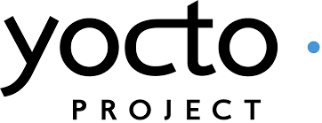

+++
title = 'Rolling you own Linux distro with yocto'
date = 2024-10-08T11:00:32+03:00
draft = true
tags = ["Linux", "yocto", "bitbake", "poky"]
+++

Assuming the board picked for development is in wide use, like the Raspberry pi the
simple choice would be to grab one of its many available Linux distributions and use its
installer to quickly flash it to the SD card. And at first glance, this looks like the right
call. It is a fast way to start rolling with an almost zero learning curve. But going down
this road does come with a price. You become completely dependent on the vendor (and policy
impost by vendor), It is difficult to remove bloat from the system, and adding your software and
configuration is done after the OS image is provisioned on the device. In most cases, the
distributions won't be targeted for embedded, are not cross-development-friendly (compile on the
device only which is slow), and are not patched for real-time performance. And this is before we
talk about devices with different boards and configurations that share common application
logic which needs to be updated and maintained. Taking an off-the-shelf OS approach is perfectly fine but it is
mostly suitable for the evaluation of s new board or when using it for hobbyist/maker projects.

The next logical step is to build a custom Linux distribution from scratch. but unlike building a single
small project from the source this is a herculean task that a simple Cmake just can't handle. In broad strokes
when building your own Linux distribution you will need to download the source for Linux kernel and bootloader,
download the source for a bunch of libraries and applications. Patch, configure and compile everything.
put all the output files into a staging area that looks like a Linux root filing system. And finally, convert
everything to a filing system Flash image. And then you are still left with configuring all of this for
multiple devices which may use different architecture and drivers. So a build system for creating custom embedded
Linux distributions needs to be defined.

Provide a mechanism for building distributions based on configurations (infrastructure as a code), so provisioning of
images will be highly modular, with software encapsulated by functionality(hardware/BSP, user applications...) in such a
way that each module can be removed and added as a piece of LEGO. Reproducible, so the build process is fully transparent
to the user. Provide support for multi-developer collaboration. Allow for the execution of tasks(get source code for the
library, compiling user application, apply patches...) in parallel while arranging tasks in such a way that order takes into
account dependencies. Provide license management and stop the build if an incorrect license is used. It is not an IDE, it
is not intended for iterative development(too slow) only to provision images to be flashed to a device once all the software
wrinkles are ironed out. For development, a cross-compile toolchain is provided as part of the SDK. It is not a distribution
tool, it is intended for provisioning.

So why Yocto?
Pros:
- Widely supported by semiconductor vendors with an active developer community.
- It is organized into separate layers(for software encapsulates )which can move at their own pace with
  separate release schedules. which makes it highly customizable and expandable.
- By providing SDK it creates separations between kernel/user space development.
- OS images defined by the project are architecture agnostic.

- Optimized for performance by utilizing smart dependency management, the parallelism of task execution, and the use of cache.

Cons:
- Steep learning curve
- Unfamiliar environment to non-embedded developers
- Resource-intensive in the form of long initial build times and use of large disk space.

