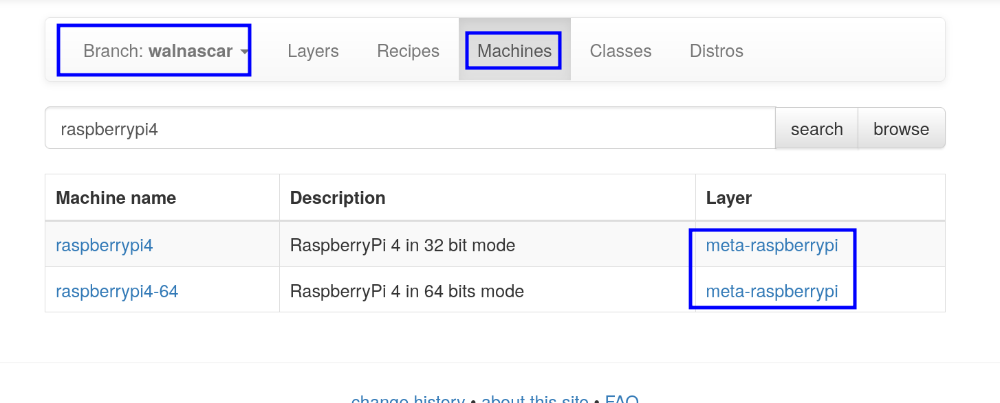
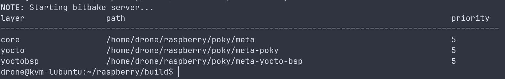
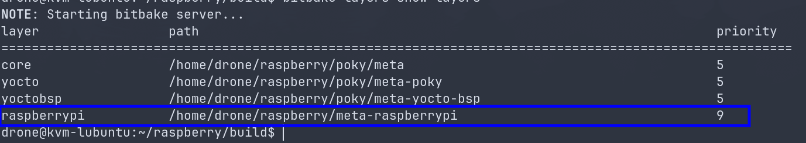
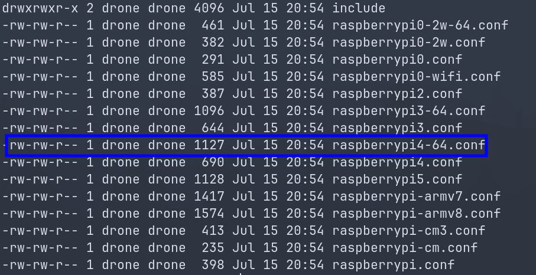
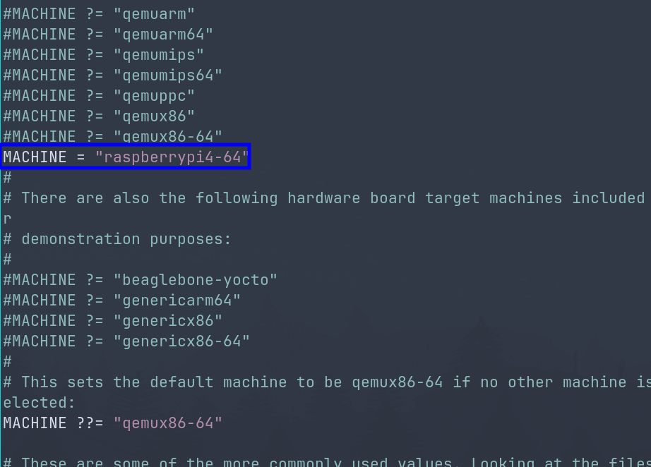
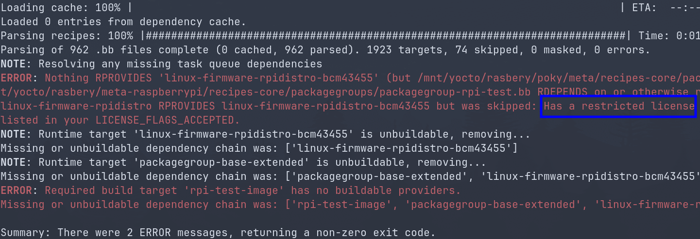
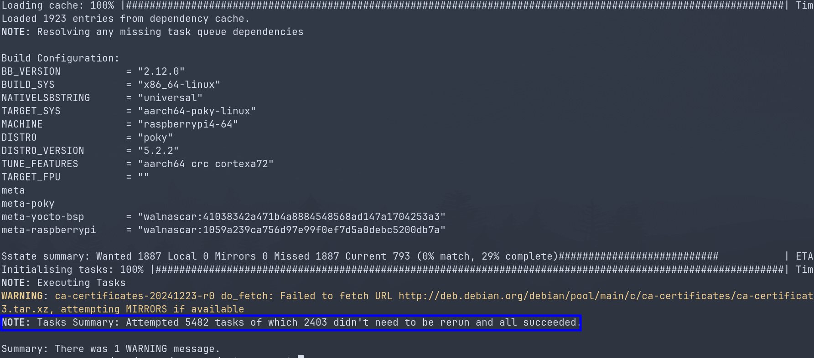
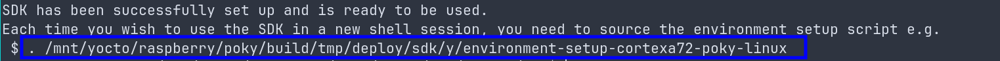

+++
title = 'Intro to Yocto, part 4 - Yocto for raspberry pi4, build, boot, and cross compile'
date = 2025-07-21T22:00:07+03:00
draft = false
tags = ["Linux", "Yocto", "bitbake", "poky", "raspberry"]
+++

---
**All posts in this series:**
1. [Intro to Yocto, part 1 - Rolling your own Linux distro with yocto](/posts/rolling_you_own_linux_distro_with_yocto)
2. [Intro to Yocto, part 2 - Hands-On Introduction to BitBake](/posts/hands_on_introduction_to_bitbake)
3. [Intro to Yocto, part 3 - Building a Poky (Yocto Project) Image for QEMU](/posts/building_a_poky_yocto_project_image_for_qemu)
4. (current) [Intro to Yocto, part 4 - Yocto for raspberry pi4, build, boot, and cross compile](/posts/yocto_for_raspberry_pi4_clone_build_boot)

---

# Preface
The goal of this post is to customize the Yocto reference distribution, Poky
to create a bootable image for the Raspberry Pi4. This involves aspects of what is
often termed as "board bring-up", specifically adapting the build system for new
hardware. And will also cover cross-compilation.

Choosing the Raspberry Pi4 as the target hardware for this post is deliberate decision
rooted in how wide spread the use of this board for prototyping and the fact that
there is already a Yocto BSP layer for it.

Although the yocto project does provide a reference distribution called Poky, it
does not include official support for Raspberry Pi boards out of the box. Instead
this support is provided through a separate BSP (board support package) layer
that can be included as a layer for poky. This post which is the final
part in a series of post, is building upon previews topics and extend the creating
of an image form poky as it was covered in [Building a Poky (Yocto Project) Image for QEMU](/posts/building_a_poky_yocto_project_image_for_qemu).

I will be using Ubuntu 24.04.2 LTS, and will have about 100G of free space, and the
walnascar Yocto version.

# Prerequisites
We will start by creating a directory which will be used for keeping the repositories
and for building the image.

Install required packages:
```bash
sudo apt install liblz4-tool gawk wget git-core diffstat unzip texinfo gcc-multilib build-essential chrpath socat libsdl1.2-dev xterm
```

```bash
mkdir ~/raspberry
cd ~/raspberry
```

Disable app armor temporary:
```bash
echo 0 | sudo tee /proc/sys/kernel/apparmor_restrict_unprivileged_userns
```

## Getting Poky, the Yocto reference distribution
<u>Poky is the actual Linux distribution it will be used for configurations, it will include other
layers into it, and will be responsible for the build of the image</u>.

We will clone it inside of the ~/raspberry directory:
```bash
 git clone git://git.yoctoproject.org/poky -b walnascar ~/raspberry/poky
```
Note that I am using the walnascar branch, and all other repositories I will be cloning must use the
same branch as it is the Yocto version.


## Getting the raspberry pi layers
As mentioned The Raspberry pi4 isn’t part of the reference BSP layers available as part of the poky reference
repository and so we will be getting it separately.

Go to [OpenEmbedded Layer Index](https://layers.openembedded.org/layerindex/branch/master/layers/) and pick walnascar as the branch and perform
a search under Machines using raspberrypi4 keyword.


Pressing the links for the layers(meta-raspberrypi) will provide with the git repository address which is at
git://git.yoctoproject.org/meta-raspberrypi so it is also cloned along side poky with the same walnascar branch:
```bash
git clone git://git.yoctoproject.org/meta-raspberrypi -b walnascar ~/raspberry/meta-raspberrypi
```

### Getting the dependencies for the meta-raspberrypi layer
The layer meta-raspberrypi itself might have its own dependencies(other layers) that we will need to
look at and for that we can look at the ~/raspberry/meta-raspberrypi/README.md and more specifically
at the "Dependencies" section
```text
## Dependencies

This layer depends on:

* URI: git://git.yoctoproject.org/poky
  * branch: master
  * revision: HEAD
```

As a side node walnascar version has only the poky as its dependence meaning there is no other layers
that need to be included, but in the past while using the "zeus" version I came across a README.md file that
had:
```
## Dependencies

This layer depends on:

* URI: git://git.yoctoproject.org/poky
  * branch: master
  * revision: HEAD

* URI: git://git.openembedded.org/meta-openembedded
  * layers: meta-oe, meta-multimedia, meta-networking, meta-python
  * branch: master
  * revision: HEAD
```

Note that not only there was a need to clone meta-openembedded but there was a need to
include specific layers (meta-oe...) it provides.

# Configuring Poky to build an image for raspberrypi4

## Including the extra layers for raspberrypi4
It is not enough to download all the layers required for building the Raspberry pi4 image it is necessary to include
them into the poky build.

1. We will start by creating a build directory inside of ~/raspberrypi by sourcing oe-init-build-env
```bash
. poky/oe-init-build-env build
```

This will a build directory along side the two repositories we cloned(and shell will switch to the build dirctory):
```text
drwxrwxr-x  ./
drwxr-xr-x  ../
drwxrwxr-x  build/
drwxrwxr-x  meta-raspberrypi/
drwxrwxr-x  poky/
```

2. Inside of the build directory we will list the current layers for poky to include:
```bash
bitbake-layers show-layers
```




3. In order to add meta-raspberrypi layer we will execute form the build directory:
```bash
bitbake-layers add-layer ../../meta-raspberrypi/
```

Now we can verify they layer was added by listing the layers again

This list reflects the sate at: ~/raspberry/build/confg/bblayers.conf

To complete for reference the initial note I made regarding the meta-raspberrypi
dependencies with the older Yocto zeus version, I should note that I did not include the
entire meta-openembedded repository rather I used the specific dependence layers.
```bash
bitbake-layers add-layer ../meta-openembedded/meta-oe
bitbake-layers add-layer ../meta-openembedded/meta-python
bitbake-layers add-layer ../meta-openembedded/meta-multimedia
bitbake-layers add-layer ../meta-openembedded/meta-networking
```
## Setting local.conf
We start by looking at the lease of boards(BSP) supported by the meta-raspberrypi
repository to verify that raspberrypi4 is supported by listing the files inside of
~/raspberry/meta-raspberrypi/conf/machine


I will pick raspberrypi4-64.

I will edit ~/raspberry/build/conf/local.conf and set my machine as
```text
MACHINE = "raspberrypi4-64"
```



## Enabling UART(optional)
Raspberrypi3(not sure about raspberrypi4) does not have the UART enabled by default, to enable it I just append to
the end of the ~/raspberry/build/conf/local.conf file:
```text
ENABLE_UART = "1"
```

# Building the image
It is finally time to build the image for raspberrypi4. Going back to the README.md file
that is provided by meta-raspberrypi, we can look at the "Quick Start" section:
```text
## Quick Start

1. source poky/oe-init-build-env rpi-build
2. Add this layer to bblayers.conf and the dependencies above
3. Set MACHINE in local.conf to one of the supported boards
4. bitbake core-image-base
5. Use bmaptool to copy the generated .wic.bz2 file to the SD card
6. Boot your RPI
```

The name of the recipe to create the image is core-image-base. So from
~/raspberry/build/ we can execute(assuming we still have oe-init-build-env sourced):
```bash
bitbake core-image-base
```


Once that was done an error was encountered, regarding the restriction of a license:


The fix is to accept the restricted license as part of the build(which is perfectly fine in the scope
of this post). To do so we will append to the end of local.conf
```text
LICENSE_FLAGS_ACCEPTED += "synaptics-killswitch"
```

Which should resolve the issue and you should be able start building.

<u>Note that bitbake is pulling a lot of repositories for this build, you might see warning about looking for another mirror.
If bitbake completely fails to fetch source, run the above command again.</u>

And Once the build is complete you will get a summary that should show all tasks succeeded.


# Flashing the image to SD card
All of the artifacts form the build will be at: ~/rasbery/build/tmp/deploy/images/raspberrypi4-64
with raspberrypi4-64 being the architecture we picked for the build. It will have
- **.dtb**: which are device tree blobs, which describe the hardware configurations of the Raspberry pi
and any potential peripherals.
- **.dtbo**: Are "overlays" that can be loaded at boot time to enable and modify specific hardware components.
- **Image-**: Are the compiled Linux kernel.
- **.ext3**: The root file system, the actual operating system(applications, libraries...).
- **modules-**: comprised archive with all the kernel modules(*.ko)
- **bootfiles directory**: Often contains Raspberry pi bootloader components.
- **core-image-base-raspberrypi4-64.rootfs.wic.bz2**: This is the compassed disk image
that contains the entire bootable system(bootloader, kernel, device tree, and rootfs), correctly laid out for
n SD card. <u> This is the primary file we will be using in the scope of this post</u>

1. First we will decompress the image file:
```bash
bunzip2 -c core-image-base-raspberrypi4-64.rootfs.wic.bz2 > core-image-base-raspberrypi4-64.rootfs.wic
```

2. Next insert the SD card into your PC and using lsblk find it, after you do execute
```bash
sudo dd if=core-image-base-raspberrypi4-64.rootfs.wic of=/dev/sde bs=4096 status=progress && sync
```

3. Insert the SD card into the Raspberry Pi4 and it should boot with the image we created.

# Creating SDK for cross compilation
Yocto/Poky is a great tool when you need to build an entire operating system
image, but it becomes highly impractical for iterative application development.
Compiling your application by modifying BitBake scripts and rebuilding the
entire image, even for minor changes, is significantly slower than compiling
directly with a compiler. The overhead becomes even greater for a completely
new application, which requires a substantial amount of Yocto-specific work to
be properly integrated into the build system. Not to mention that each
development iteration would necessitate flashing an entire new image to your
device, which is simply not a practical workflow.

It makes much more sense to develop the application locally, and test it just by dropping
it on the embedded device, the same way you would when you are developing on you PC.

However, developing directly on an embedded device like the Raspberry Pi, is not practical,
As the image for the device lacks compilation tools and even if we include those the
CPU of the device is no match to a powerful multi core build server.

Furthermore, we can"t just compile code on our build server running
Ubuntu 24.04.2 LTS, using its native toolchain as it will not match the
architecture and it will link the executable with its own libraries which will
probably differ from the ones used by the embedded device.

The **cross-compilation toolchain** is a set of tools that can run on your
build server and produce binaries that are specifically designed to run
correctly on your embedded device.

In order to build the sdk we will use the populate_sdk argument:
```bash
bitbake core-image-base -c populate_sdk
```

Once the build is finished successfully the sdk should be located at
~/rasbery/build/tmp/deploy/sdk

We will need to install it on the build server where it will be used
```bash
sudo <name_of_toolchain>.sh
```
You will be asked a few details about the installation, and once done the installation
will start.

Once it is done successfully, you will notice that path you will need to source in order
to go into the cross-compilation environment.


## Cross compiling
In order to use it you will need to source its environment variables using the path
we got at the end of the installation, E.g:
```bash
. /mnt/yocto/raspberry/poky/build/tmp/deploy/sdk/y/environment-setup-cortexa72-poky-linux
```

Once this is done you can check the value of $CXX and see it is defined with the cross compiler
of the toolchain, by doing executing:
```bash
echo $CXX
```

With the expected value being, as an example :
```text
aarch64-poky-linux-g++ -mcpu=cortex-a72+crc -mbranch-protection=standard -fstack-protector-strong -O2 -D_FORTIFY_SOURCE=2 -Wformat -Wformat-security -Werror=format-security --sysroot=/mnt/yocto/raspberry/poky/build/tmp/deploy/sdk/y/sysroots/cortexa72-poky-linux
```

Now in order to compile for the Raspberry Pi4 you can use:
```bash
$CXX hello_world.cpp
```

Then copy it onto the Raspberry Pi4 and it should work with no architecture or linking issues.

